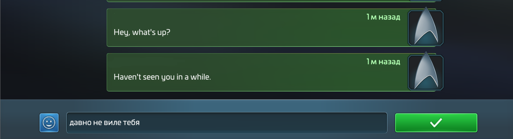

# UniversalTranslator plugin/mod for Star Trek Fleet Command™ game client
Tested with STFC client v1.000.41571 (Update 77.0.0)
Designed to use with [BepInEx.Legacy](https://github.com/Plurimus/BepInEx.Legacy) framework.
Recommended to use with [BepInExConfigManager.Il2Cpp](https://github.com/sinai-dev/BepInExConfigManager) plugin as ingame settings editor

## What it does
This mod changes some interface windows/pop-ups/menus:
- Adds button to chat message menu
- Translates message one by one to choosed language in settings
- Translates outgoing message oon the fly to choosed in settings language (v1.5.1)
  
## How to install
- unpack BepInEx framework release archive into STFC game folder which is usually located at `C:\Games\Star Trek Fleet Command\Star Trek Fleet Command\default\game`
- run the game client and wait until BepInEx will make unhollowed assemblies in `..\BepInEx\unhollowed\` folder
- delete from `..\BepInEx\unhollowed\` folder the `Newtonsoft.Json.dll` and `UnityEngine.TLSModule.dll` (it can bother other mods)
- unpack [BepInExConfigManager.Il2Cpp](https://github.com/sinai-dev/BepInExConfigManager) plugin to `..\BepInEx\` folder
- unpack Optimus.STFC.UniversalTranslator archive to BepInEx folder so it will copy `Optimus.STFC.UniversalTranslator.dll` and `Newtonsoft.Json.dll` to `C:\Games\Star Trek Fleet Command\Star Trek Fleet Command\default\game\BepInEx\plugins\`
- make a link file to `prime.exe` and start the game client with it to avoid automatic updates
- use F5 to open plugin settings window in game client to change the settings. 

## Used libraries
- [BepInEx/BepInEx.IL2CPP](https://nuget.bepinex.dev/packages/BepInEx.IL2CPP) - v6.0.0-pre.1
- [BepInEx/BepInEx.PluginInfoProps](https://nuget.bepinex.dev/packages/BepInEx.PluginInfoProps) - v2.1.0
- [JamesNK/Newtonsoft.Json](https://github.com/JamesNK/Newtonsoft.Json) - v13.0.1

## Support
For STFC BepInEx items, please visit the [BORG Box](https://discord.gg/8MRcfserGH) discord server.

## Result screenshots

